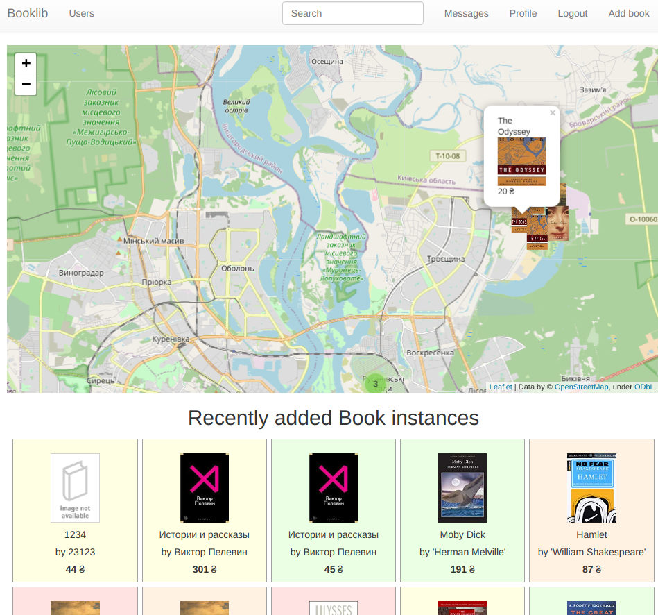
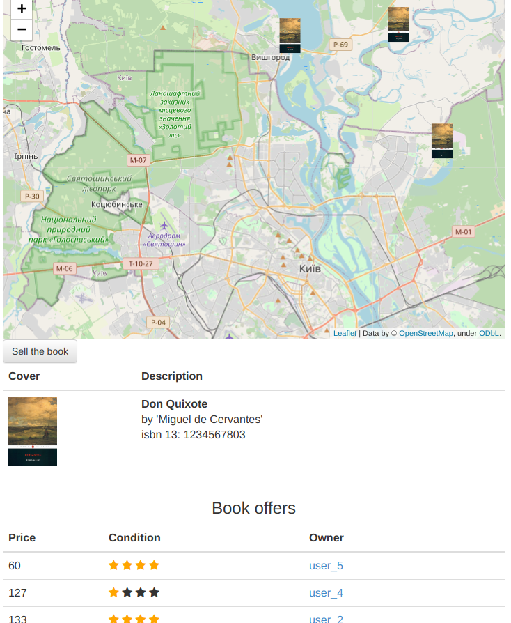
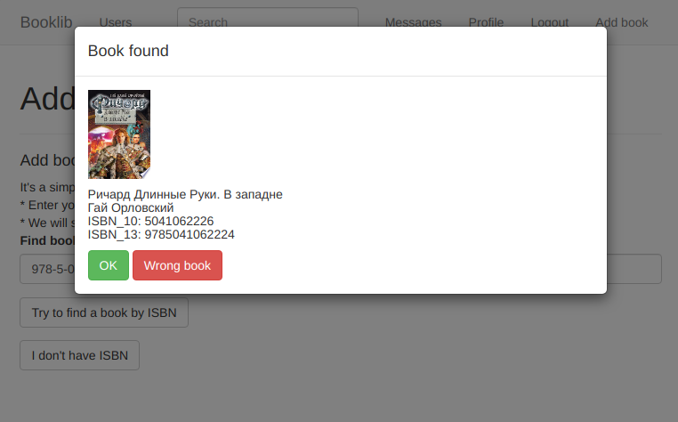

# BookMap

Pet project for learning purposes.  
  
__General idea__ - create a marketplace for P2P selling books optimized by users location. It's much easier to buy used book if it's owner lives nearby.  


[Demo] (https://bookmap-2020.herokuapp.com/) refresh if 'internal server error', free Heroku plan is not reliable for the load.
Main view:  
  
Book Page:  
  
Add a book instance (book is found by isbn at google books) :
  

## Tech stack
* [Flask](https://flask.palletsprojects.com/en/1.1.x/)
* [Postgresql](https://www.postgresql.org/)
* [Flask-Admin](https://flask-admin.readthedocs.io/en/latest/)
* [Bootstrap3](https://getbootstrap.com/docs/3.3/)
* [Folium](https://python-visualization.github.io/folium/)
* [Flask-Admin](https://flask-admin.readthedocs.io/en/latest/)
* [dotenv](https://pypi.org/project/python-dotenv/)

## Install
1) create and activate virtual environment `venv`
2) `pip install -r requirements.txt`
3) `flask run`  
  
To play with sample data - visit `http://127.0.0.1:5000/populate_db`. It populate db with the data.  
To clear db - visit `http://127.0.0.1:5000/unpopulate_db`  
To be able to register/login (via OAuth2) you have to create `.env` 

`.env` example:
```
export GOOGLE_CLIENT_ID = "1444443463-4730kg6jtq5umgt8vlwf5ohi8ej22307.apps.googleusercontent.com"  
export GOOGLE_CLIENT_SECRET = "s7WSqwgvE__hwtuvHq7JkqECqwf"  
export MAIL_SERVER=smtp.gmail.com  
export MAIL_PORT=465  
export MAIL_USERNAME=email@gmail.com  
export MAIL_PASSWORD=email_password  
```
Note that Google's SMTP server requires the configuration of "less secure apps". See https://support.google.com/accounts/answer/6010255?hl=en
  
Main objects are `Book` (has `title`, `author`, `isbn` etc.) and derived object `BookInstance` (i.e. instance of a `Book`, it has it's own `price`, `condition`, owner location). For example `Book` 'Tom Sawyer' might has some `BookInstance` offered from different `Users`, with different `price`, `condition` and location.  
  
When a user wants to add new `Book` the ccrypt firstly checks by isbn if  such `Book` is already exist in local DB, secondly check  
(by [google books API](https://developers.google.com/books/docs/v1/using)) if Google Books has an informatinon about the book with the `isbn`. If Google books has the information that the info (`isbn`, `title`, `authors`, `cover`) offered to the `User` for use. Otherwise `User` is able to add a `Book` in fully manual mode. When `Book` created in DB `User` is able to add `BookInstance` of it.  
  
`.env` also contains mail settings vars. It's used to send email notification to Users. Currently a notification sent in two cases:
* User got a private message from other User; 
* Users BookInstance reach 'expired' state (30 days from publishing) and have to be re-activated manually by User.  
Checking expired BookInstance made as cron task with  `BackgroundScheduler()`
Map view is centered by User location which is received by IP from `ipapi` service.  
Users with Adiministrator privileges able to manage the DB data with Flask-Admin interface.  

  
### TODO (unsorted ideas possible next steps and known bugs):
* Refactor and made more clean & concise :)
* Add change user_name during initializating new account only.
* Clasterize book instances by location with [geoalchemy-2](https://geoalchemy-2.readthedocs.io/)  or [h3](https://h3geo.org/)?
* If noone or only you (as `User`) is a `BookInstance` owner then you can manage the related `Book` attributes (title, cover etc.). How to? -> add `book.is_editable`
* Add cron job to  clear tmp folder (if many files found there).
* Add _'blame for the book (incorrect/ violent data)'_
* Add _'offer book cover'_ (if no bookcover currently) -> _'Offer better book cover'_(?)
* Data caching? 
    * Do not render _map.html for each User, render it with Scheduller in thread only if Book were added/removed ... or by time. 
    * Hide 'new book' button for users who are not `allow_to_create_a_book()` any more (Limits included already). Store var 'show_add_new_book' in session?
* Try to switch to GraphQL _(what for? Models are not heavy... yet. OK, do it jest for fun and experience)_
* Gmail allows to send 100-150 messages daily. If out of the limit -> look at SendGrid или MailChimp.
* Add footer
* Made a messages view as threads (it's about indentation in html)
* Separate css from html (now some mess is there).
* Rename `BookInstance.Description` to `BookInstance.Comment`. It's better name for it.
* Write a normal tests at last!

### Note  
First created User (User.id == 1) has Admin access (i.e. has access to http://127.0.0.1:5000/admin/). Fix it with bash-psql script for safety reasons?  
Google's SMTP server requires the configuration of "less secure apps". See https://support.google.com/accounts/answer/6010255?hl=en
